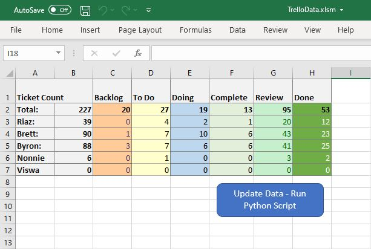
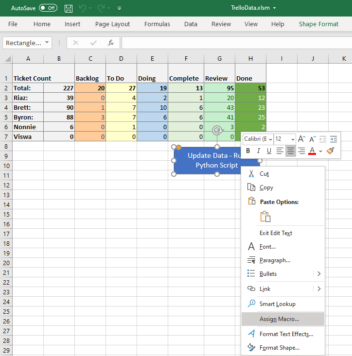
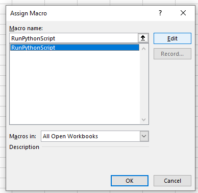
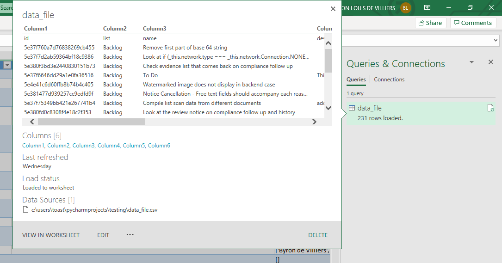
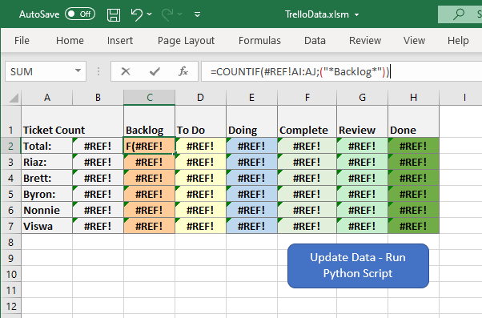
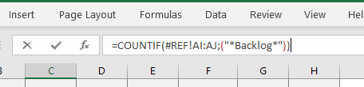
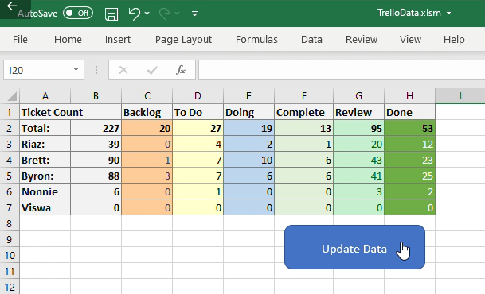
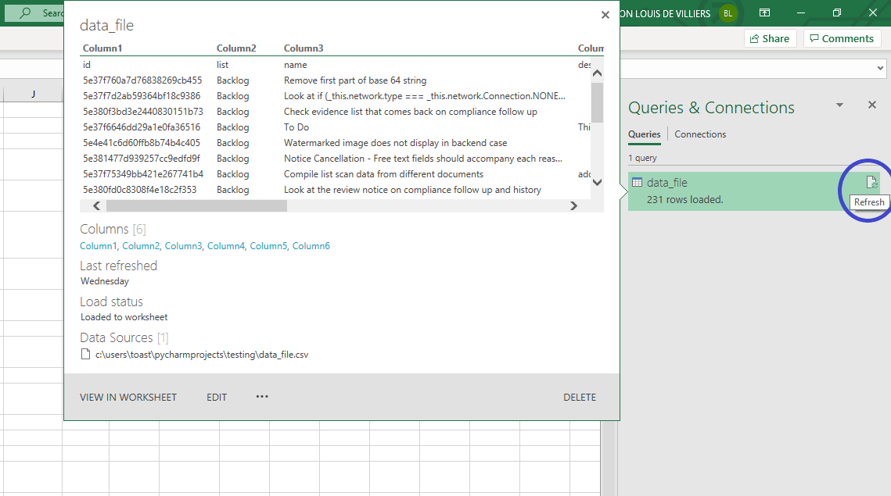

# Trello-To-Excel-Tool
This is a tool which uses the trello api to request the kanban board data in JSON format and write that to csv. The VBA Macro are used to run the python script form excel. The excel file then queries the data from the csv file the python script updated.

[](https://github.com/ByronDev121/Trello-To-Excel-Tool/)

Installing Python
--------------
First install Python on your machine. [This](https://www.howtogeek.com/197947/how-to-install-python-on-windows/) is a great tutorial.

Installing dependecies 
--------------
To install all dependecies required for this project there is a requirements.txt file included in the repository. Simply create a new enviroment in anaconda/whatever container manager you are using or open up shell, cd to/project/directory and run the following command:

```bash
pip install -r requirements.txt 
```

Get an API key and Auth token from Trello
--------------
Get a Trello developers API key [here](https://trello.com/app-key/). Click on token to manually create a token.

Add Credetails to Python Script
------
Open 'json_to_csv.py' in any text editor or IDE and your credentials in line 6 and 7:
```python
# Set your credentials here:
api_key = 'YOUR_API_KEY'
token = 'YOUR_AUTH_TOKEN'
```

Set up TrelloData.xlsm 
------
1. Open TrelloData.xlsm 

2. In the 'Analytics' sheet, right click on the button named 'Update Data - Run Python Script' > Assign Macro...



Then click 'RunPythonScript' and then click edit.



3. Add paths to your python executable and python script(json_to_csv.py) to PythonExe and PythonScript variables on line 10 and 13:
```vba
'Path to python
PythonExe = """C:\your\path\to\python.exe"""

'Path to python script
PythonScript = """C:\your\path\to\Trello-To-Excel-Tool\json_to_csv.py"""
```

3.1. To find out what your python.exe path is, open terminal and run:
```bash
python
```

```bash
>>import os
>>import sys
>>os.path.dirname(sys.executable)
```

5. Once the python script is running the last thing left in the setup is recreating the query to data_file.csv. 

5.1 In the excel file 'TrelloData.xlsm'. Click the data tab > open queries and connections and delete the exciting qeury.



5.2. Then in the tool bar click new qeuery > file/csv and choose the data_file.csv int he directory.

5.3. This should create a new sheet: 'Sheet1' Rename thta sheet to Trello_Data and delete the old one. 

6. Lastly you'll have to update/replace the reference to Trello_Data everywhere #Ref exists in the Analytics sheet.



*Maybe there is a better way to do this please let me know if you find a cleaner solution*
6.1. Just replace #Ref with Trello_Data *(Or whatever you renamed your trello data sheet to)*



Usage
--------------
### Fetch live data from trello and write it data_file.csv
Clicking the button called "Updated Data" in the Analytics sheet will execute the macro script to invoke the json_to_csv.py. 

The python script qeuries Trello, using your authentication details, for your board data. The first query is light on data but return the Project ID. The board data is filtered by the Project ID you set. The board ID is used to query trello a second time asking for a more data heavy payload, which includes card, member and List data. The script organises the data and writes in to the data_file.csv.


  
### Update Trello_Data sheet in TrelloData.xlsm 

Open Queries and Connections and upadte the data from data_file.csv but clikcing on the update icon.



#### Your All Set!!!
You can now report, find, group, calculate metrics and give analytics on **Live** data much more easily compared to a manual process. 

License
-------

The code in this repository is distributed under the MIT License.
